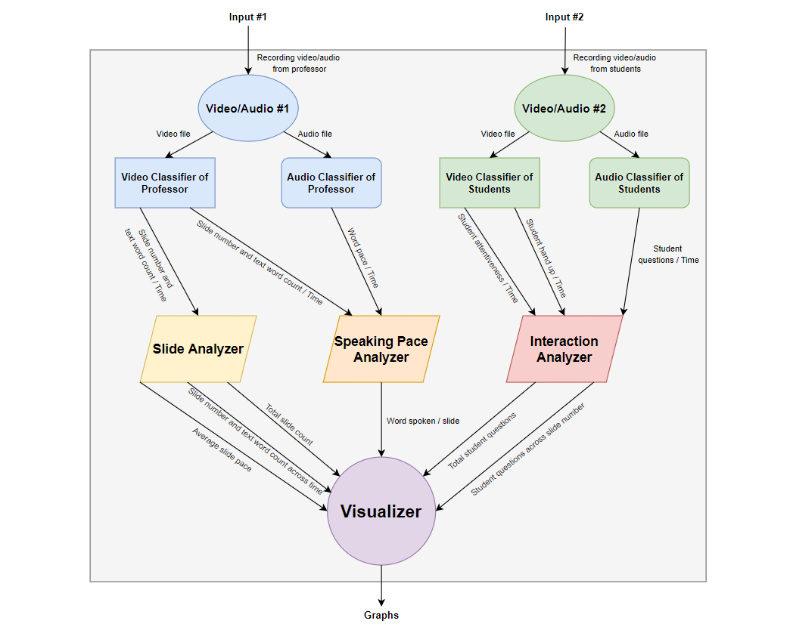

# ECE_Team9_Capstone
**AI teaching assistant.  Facial recognition and behavioral processing.**

Elevaor Pitch:
Our sponsor, Christof Teuscher is an Alan Turing enthusiast and avid runner.  His proposal, “An AI-based Teaching Practices and Classroom Activities Tool to Improve Education” is an automated tool that must use AI to analyze student and teaching behaviors using a simple recording device, like a cell phone.  That analysis should include student interaction and presented teaching materials.  It may also consider the teacher's presentation style.  We must deliver a functional prototype using a cell phone to record and analyze full-length class sessions.  We also must deliver relevant documentation.  We expect to encounter COVID related collaboration issues and we are concerned about accidental feature creeping technological overreach.

This project will allow a user, such as a professor, to record their lecture and their student’s response to different moments within that lecture.  These recordings will be uploaded and processed. The user will receive a report back from this program that describes to them how their students responded to different moments throughout that lecture (description detailed in “Requirements”).  The user can then use this feedback to modify their future teaching behaviors to maximize student interaction or student attentiveness in accordance with their goals and repeat the analysis.

Our project must have the ability to receive and analyze one full-length class lecture recording from two perspectives.  These perspectives must include the professor with their presented materials and the student audience.  These recordings will be processed by a program that must be able to analyze those two recordings and produce a visualization, containing information outlined below, in a form where a non-technical user can glean informative feedback.  This feedback will describe the user’s teaching behavior across time and the commensurate effects of those changes on the student audience.



[Proposal Document](https://docs.google.com/document/d/1YcNP2XVLgDVtbruc-ptutkXsHnPfJws35ECDuVT-Fk0/edit?usp=sharing)


## Disclaimer
This project is in active development. it is pre-alpha


## Requirements
This project was built with python 3.8 (it might work with over versions)

This project was tested with Windows and Linux.

[ffmpeg](https://ffmpeg.org/) needs to be installed and added to your [path](https://helpdeskgeek.com/windows-10/add-windows-path-environment-variable/)

### Installation

```
git clone https://github.com/jb-codemaker/ECE_Team9_Capstone.git
cd ECE_Team9_Capstone
pip install -r requirements.txt
```